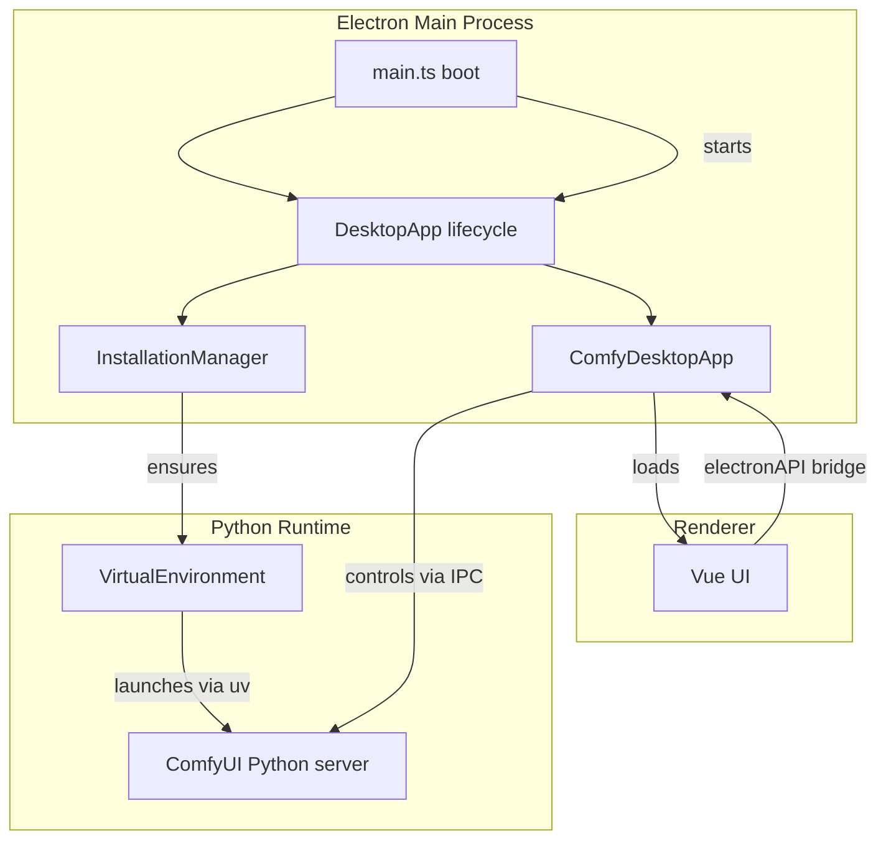

# Python & AI Integration Architecture

This document describes how ComfyUI Desktop packages and runs Python- and AI-centric workloads inside an Electron application, and captures practices you can reuse when building a similar multi-platform desktop app.

## 1. Overall Architecture

- `main.ts` performs one-time setup, instantiates the `DesktopApp`, and hands off control once Electron is ready.【F:src/main.ts†L17-L75】
- `DesktopApp` orchestrates installation, telemetry consent, starting the Python server, and renderer loading, delegating to `InstallationManager` for setup and `ComfyDesktopApp` for runtime control.【F:src/desktopApp.ts†L29-L208】
- `ComfyDesktopApp` launches the bundled ComfyUI server through a managed virtual environment, exposes restart controls over IPC, and initializes automatic updates via ToDesktop.【F:src/main-process/comfyDesktopApp.ts†L18-L154】
- The Python runtime lives entirely inside a managed virtual environment that is created and maintained by the `VirtualEnvironment` helper using the `uv` package manager.【F:src/virtualEnvironment.ts†L103-L334】
- Once the Python server exposes HTTP endpoints, the Electron `AppWindow` points Chromium at that URL so the Vue renderer can interact with ComfyUI like a web client.【F:src/main-process/appWindow.ts†L98-L139】【F:src/main-process/appWindow.ts†L184-L203】

## 2. Communication Layer

- IPC channels centralize communication; the `IPC_CHANNELS` constant enumerates everything from install progress to terminal control.【F:src/constants.ts†L1-L188】
- The preload script exposes a typed `electronAPI` bridge that relays installer validation, network checks, uv management, update triggers, and Python restarts to the renderer without enabling node integration.【F:src/preload.ts†L320-L478】
- Server lifecycle controls run on the main process—`ComfyDesktopApp` handles `RESTART_CORE` requests and forwards Python stdout/stderr to the window log stream.【F:src/main-process/comfyDesktopApp.ts†L76-L154】【F:src/main-process/comfyServer.ts†L128-L223】
- Renderer UI reacts to install progress via IPC events emitted by `AppWindow` (`LOADING_PROGRESS`) and installation stage broadcasts, ensuring consistent status presentation across processes.【F:src/desktopApp.ts†L182-L208】【F:src/main-process/appWindow.ts†L150-L172】

## 3. Packaging Python & AI Dependencies

### Bundled Resources

- Electron Builder and ToDesktop both copy the curated `assets/` tree—including the ComfyUI source, ComfyUI-Manager, requirements manifests, and per-OS `uv` binaries—into the packaged app via `extraResources` entries.【F:builder-debug.config.ts†L3-L25】【F:todesktop.json†L9-L42】
- `scripts/makeComfy.js` pins upstream versions from `package.json`, checks out exact commits/tags of ComfyUI and ComfyUI-Manager, downloads the UI assets, and pre-fetches `uv` binaries for every platform so packaging is reproducible.【F:scripts/makeComfy.js†L1-L24】
- `scripts/downloadUV.js` pulls the correct `uv` artifact for Windows, macOS, and Linux, laying them out under `assets/uv/<platform>` for bundling.【F:scripts/downloadUV.js†L12-L85】

### Virtual Environment Creation

- `VirtualEnvironment` locates platform-specific `uv` binaries from the packaged resources and derives the Python interpreter path according to OS conventions (Scripts\python.exe vs bin/python).【F:src/virtualEnvironment.ts†L185-L225】
- On first run (or repair), the installer runs `uv venv --python <version> --python-preference only-managed`, guaranteeing a locally managed interpreter without requiring system Python.【F:src/virtualEnvironment.ts†L330-L344】
- After creating the environment it upgrades `pip`, installs compiled requirement snapshots when available, and falls back to `pip install` for ComfyUI and Manager requirements to keep users unblocked.【F:src/virtualEnvironment.ts†L345-L406】
- The helper monitors existing environments, verifies imports, and, when necessary, replays an incremental install or surfaces errors so the UI can offer a “reset virtual environment” option.【F:src/virtualEnvironment.ts†L266-L327】【F:src/desktopApp.ts†L118-L173】

### Large Model Assets

- Model checkpoints are not bundled; the installer asks for a writable `basePath` and stores it in user config per-OS (`config.json`, `extra_models_config.yaml`).【F:README.md†L63-L82】
- A singleton `DownloadManager` streams large files via Electron’s download session into the configured models directory, with resume/pause/cancel, and enforces that writes stay inside the user-selected sandbox.【F:src/models/DownloadManager.ts†L35-L212】
- Because models live outside the packaged resources, updates can replace app binaries without touching user assets, and downloads can be retried or migrated during maintenance flows.【F:src/desktopApp.ts†L118-L208】【F:src/install/installationManager.ts†L104-L194】

### GPU / Accelerator Support

- Hardware validation runs before installation to ensure Windows machines have NVIDIA GPUs and macOS systems are Apple Silicon; unsupported platforms fall back to manual setup paths.【F:src/utils.ts†L140-L202】【F:src/virtualEnvironment.ts†L266-L327】
- Torch mirror selection adapts to GPU type (CUDA vs Metal vs CPU) when invoking `uv pip install`, and mirrors can be overridden via settings for regional mirrors or nightly builds.【F:src/constants.ts†L168-L185】【F:src/virtualEnvironment.ts†L159-L200】【F:src/virtualEnvironment.ts†L357-L406】

## 4. Operating-System Specific Handling

### Windows

- Distribution uses NSIS; resources land under `%APPDATA%\Local\Programs\comfyui-electron` while user data lives in `%APPDATA%\ComfyUI`, isolating binaries from mutable files.【F:README.md†L39-L50】
- The custom NSIS script (referenced in ToDesktop config) drives uninstall options such as removing the managed `.venv`, cached updates, or wiping the entire base path, ensuring Python DLLs and caches are cleaned safely.【F:todesktop.json†L38-L42】【F:scripts/installer.nsh†L1-L210】
- `VirtualEnvironment` generates Windows-specific activation commands and uses PowerShell to manage `uv`, abstracting path and ExecutionPolicy quirks away from users.【F:src/virtualEnvironment.ts†L246-L257】【F:src/virtualEnvironment.ts†L451-L502】

### macOS

- The app is delivered as a DMG that drops into `/Applications`, with runtime data stored in `~/Library/Application Support/ComfyUI`.【F:README.md†L51-L71】
- Only Apple Silicon systems pass hardware validation; the installer exits early on Intel Macs to avoid unsupported Metal paths.【F:src/utils.ts†L145-L157】
- Additional binaries to sign/notarize include the packaged `uv` executables, ensuring Gatekeeper accepts the embedded Python toolchain.【F:todesktop.json†L31-L37】
- Shell activation scripts use `source <venv>/bin/activate`, keeping macOS sandbox-friendly by avoiding system Python reliance.【F:src/virtualEnvironment.ts†L246-L255】

### Linux

- Electron Builder targets AppImage by default, while runtime data lives under `~/.config/ComfyUI`, mirroring the other OS conventions.【F:builder-debug.config.ts†L21-L24】【F:README.md†L59-L71】
- `uv` binaries for Linux are bundled and executed from the app resources, preventing dependency drift across distros.【F:src/virtualEnvironment.ts†L207-L225】
- Because `uv` installs everything into the local `.venv`, the app avoids conflicting with distro package managers and can ship consistent wheels compiled for glibc-based systems.【F:src/virtualEnvironment.ts†L330-L406】

### Environment Abstraction

- Activation commands, interpreter paths, and `uv` command wrappers adapt automatically per OS, so node processes can issue identical high-level requests regardless of platform.【F:src/virtualEnvironment.ts†L202-L257】【F:src/virtualEnvironment.ts†L437-L456】
- Installer validation checks for Visual C++ redistributables on Windows while skipping them elsewhere, and can launch external links (e.g., Git download) when prerequisites are missing.【F:src/main-process/comfyInstallation.ts†L126-L177】【F:src/install/installationManager.ts†L122-L194】

## 5. Local User Execution Flow

1. On first launch `InstallationManager.ensureInstalled` inspects prior state, validates, or triggers a full onboarding wizard with GPU checks and git prerequisites.【F:src/install/installationManager.ts†L30-L194】
2. Users pick an install path; the wizard provisions directories, copies ComfyUI assets, and then `VirtualEnvironment.create` builds the Python environment and installs requirements, emitting status updates over IPC.【F:src/install/installationManager.ts†L152-L194】【F:src/virtualEnvironment.ts†L266-L406】
3. Once dependencies are ready, `ComfyDesktopApp.startComfyServer` launches ComfyUI via the packaged Python, streams logs into the UI, and waits for `/queue` to respond before loading the front-end.【F:src/main-process/comfyDesktopApp.ts†L99-L118】【F:src/main-process/comfyServer.ts†L128-L194】
4. Automatic updates are configured to poll hourly and can be triggered manually from the renderer; updates swap Electron bundles without disturbing the Python environment or models thanks to resource separation.【F:src/main-process/comfyDesktopApp.ts†L66-L118】【F:src/preload.ts†L456-L478】
5. Subsequent launches reuse the validated installation, only repairing pieces that fail validation (e.g., missing `uv`, corrupt `venv`), providing a self-healing experience.【F:src/main-process/comfyInstallation.ts†L81-L185】

## 6. Maintainability & Reproducibility

- Dependency versions—including ComfyUI, the front-end bundle, ComfyUI-Manager commit, and `uv` version—are pinned in `package.json`, making asset rebuilds deterministic across CI and developer machines.【F:package.json†L13-L44】
- Validation logic inspects Python interpreter availability, package completeness, and upgrade requirements, marking installations that need remediation and allowing controlled package refreshes.【F:src/main-process/comfyInstallation.ts†L126-L153】
- `VirtualEnvironment.hasRequirements` uses `uv pip install --dry-run` to detect drift and trigger targeted upgrades without reinstalling everything, which is crucial for long-term reproducibility.【F:src/virtualEnvironment.ts†L358-L433】
- Build scripts (`yarn make`, `electron-builder`, `todesktop build`) provide consistent packaging entry points for NSIS, DMG, and AppImage artifacts, and can run in CI to produce signed installers per platform.【F:package.json†L24-L71】
- Logs from the main process and Python server rotate automatically and live alongside user data, simplifying support and telemetry correlation across OSs.【F:src/main.ts†L46-L48】【F:src/main-process/comfyServer.ts†L136-L194】【F:README.md†L83-L90】

## 7. Applying These Patterns to Your App

To replicate this approach in your own Electron + Python AI desktop application:

1. **Bundle curated resources**: Place all Python sources, requirements, and per-OS toolchains under `assets/` (or similar) and declare them in `extraResources` so every installer contains the same payload.【F:builder-debug.config.ts†L3-L25】
2. **Use a hermetic virtual environment**: Invoke a cross-platform manager like `uv` or `python-build-standalone` from the main process to create a private interpreter per install, and surface health checks/recovery flows through IPC similar to `VirtualEnvironment.create` and `ComfyInstallation.validate`.【F:src/virtualEnvironment.ts†L266-L406】【F:src/main-process/comfyInstallation.ts†L96-L177】
3. **Streamline large assets**: Keep multi-GB model files outside the app bundle and manage them through a download controller tied to user-configurable paths, ensuring updates remain lightweight.【F:src/models/DownloadManager.ts†L35-L212】【F:README.md†L63-L82】
4. **Specialize per OS**: Teach your runtime helper to pick platform-appropriate binaries and activation commands, and adjust installers (NSIS, DMG, AppImage) to ship required frameworks or drivers automatically.【F:src/virtualEnvironment.ts†L202-L257】【F:todesktop.json†L31-L42】
5. **Automate updates and validation**: Maintain a state machine that can detect and fix missing interpreters or packages, and leverage auto-updaters to push Electron/JS changes without breaking Python environments.【F:src/main-process/comfyDesktopApp.ts†L66-L118】【F:src/main-process/comfyInstallation.ts†L126-L185】
6. **Plan for GPU diversity**: Encode accelerator detection and mirror selection logic so your installers can fetch the right wheels, or gracefully fall back to CPU paths when specialized hardware is unavailable.【F:src/utils.ts†L140-L202】【F:src/constants.ts†L168-L185】

Following these practices yields a desktop experience where non-developers can run sophisticated AI pipelines locally with zero Python setup, while developers retain precise control over dependency versions and cross-platform behavior.
